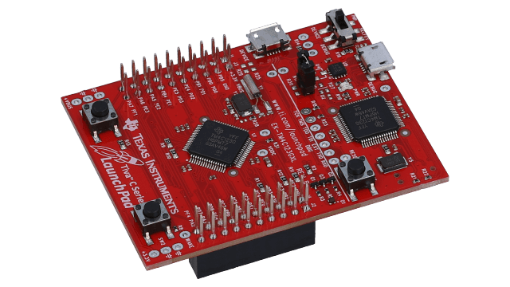

# CSE211 | Introduction to Embedded Systems

## Project Documentation   Fall 2022

## Instructor:     Prof. Dr. Sherif Hammad

## Mahmoud Mohamed Seddik Elnashar 19P3374

- [Project Architecture](#project-architecture)
  - [Hardware Used](#hardware-used)
  - [Layers](#layers)
  - [Tiva C Series ARM Cortex TM4C123](#tiva-c-series-arm-cortex-tm4c123)
  - [LCD Connection](#lcd-connection)
  - [4X4 Keypad Connection](#4x4-keypad-connection)
  - [Potentiometer Connection](#potentiometer-connection)
  - [Buzzer Connection](#buzzer-connection)
  - [Push buttons Connection](#push-buttons-connection)
- [Modules Description](#modules-description)
  - [0. Main Screen](#0-main-screen)
  - [1. Calculator Mode](#1-calculator-mode)
  - [2. Timer Mode](#2-timer-mode)
  - [3. Stopwatch Mode](#3-stopwatch-mode)
- [Appendix](#appendix)
  - [Main](#main)
  - [Modes](#modes)
  - [Calculator](#calculator)
  - [Timer](#timer)
  - [Stopwatch](#stopwatch)

# Project Architecture

## Hardware Used

1. Microcontroller: TM4C123
2. Breadboard
3. 16x2 LCD
4. 4X4 Keypad
5. Potentiometer
6. Buzzer
7. 3 push buttons
8. Jumper cables
9. Resistances

## Layers

||Layer name|Contents|
|:------------:|:-----------------------------:|:--------------------------:|
||MCAL|Peripherals: A, B, C, and E and Timers: 0 and 1|
||HAL|LCD, Keypad, Buzzer, and Push buttons|
||Application|Main Screen, Calculator, Timer, and Stopwatch|

## Tiva C Series ARM Cortex TM4C123
- The microcontroller used throughout the course.
- The GPIO peripherals used in this project are A, B, C and E.
- The GPTM timers used in this project are Timer0 and Timer1.

||Peripheral name|Usage|
|:------------:|:-----------------------------:|:--------------------------:|  
||Peripheral A|Push Buttons|  
||Peripheral B|16x2 LCD|  
||Peripheral C|Keypad|
||Peripheral D|Unused|  
||Peripheral E|Keypad and Buzzer|
||Peripheral F|Unused| 

||Timer name|Usage|Count Type|
|:------------:|:-----------------------------:|:--------------------------:|:--------------------------:|  
||Timer0|Timer|Count Down| 
||Timer1|Stopwatch|Count Up|

## LCD Connection
- The used LCD is a 16x2 LCD.
- The LCD is used in 4 bit mode to save 4 pins on the tiva from being used.
- The LCD pins are connected to peripheral B in the microcontroller and the potentiometer through the Breadboard.
- All the pins connected to peripheral B of the microcontroller are output pins.

||LCD Pin|Connection|
|:------------:|:-----------------------------:|:--------------------------:|  
||VSS (Ground) |Ground|  
||VDD (+5 volt)|VBus|
||VE (Contrast Volt)|Potentiometer|
||Register Select (RS)|PB0 on the tiva|
||Read/Write (R/W)|PB1 on the tiva|
||Enable|PB2 on the tiva|
||Data pins 0 to 3|Unused|
||Data Pin 4|PB4 on the tiva|
||Data Pin 5|PB5 on the tiva|
||Data Pin 6|PB6 on the tiva|
||Data Pin 7|PB7 on the tiva|
||LED Positive|VBus|
||Led Negative|Ground|

## 4X4 Keypad Connection
- The keypad is used to take input from the user in all of the modes.
- The keypad is connected directly to peripherals C and E on the microcontroller.
- Port E pins are output pins while port C pins are input pins.

||Keypad Pin|Connection|
|:------------:|:-----------------------------:|:--------------------------:|  
||X1|PE0 on the tiva|  
||X2|PE1 on the tiva|
||X3|PE2 on the tiva|
||X4|PE3 on the tiva|
||Y1|PC4 on the tiva|
||Y2|PC5 on the tiva|
||Y3|PC6 on the tiva|
||Y4|PC7 on the tiva|

## Potentiometer Connection
- The potentimeter is used to control the contrast on the LCD.

||Potentiomter Pin|Connection|
|:------------:|:-----------------------------:|:--------------------------:|  
||1|VBus|  
||2|VE of the LCD|
||3|Ground|

## Buzzer Connection
- The buzzer is enabled when the timer runs out.

||Buzzer Pin|Connection|
|:------------:|:-----------------------------:|:--------------------------:|  
||Positive Terminal|PE4 on the tiva|  
||Negative Terminal|Ground through 100 Ohms Resistance|

## Push buttons Connection
- The Push buttons are used to enter different modes.
- Push button 1 is used to enter calculator mode.
- Push button 2 is used to enter timer mode.
- Push button 3 is used to enter stopwatch mode.
- The push buttons are connected to peripheral A as inputs.

||Push button number|Connection|
|:------------:|:-----------------------------:|:--------------------------:|  
||1|PA5 on the tiva|  
||2|PA6 on the tiva|
||3|PA7 on the tiva||  

# Modules Description

## 0. Main Screen

- The main screen displays the different modes implemented in the project:
  1. Calculator Mode
  2. Timer Mode
  3. Stopwatch Mode

- From this screen, the user can access the different modes using the push buttons.

- The push buttons forces an interrupt taking the user to the pressed mode. If the user wishes to enter another mode he first has to exit the current mode back to the main screen.

- The following finite state machine highlights the process of entering and exiting different modes:

## 1. Calculator Mode

- The calculator takes two inputs at a time with one operator between them.
- The input is displayed on row 1 of the LCD and the result is displayed on row 2 of the LCD.
- Negative numbers are supported in the calculator.
- floating point numbers are supported.
- If the answer is floating point it is displayed with precision of 3.
- The answer can be used to make further computation and will be printed as "ANS".
- Pressing '=' on the keypad while entering the first number or after the result is printed will exit this mode and take the user back to the main screen.
- The following Flowchart highlights how the calculator works:

## 2. Timer Mode

- The Timer takes two inputs from the users which are minutes and seconds.
- The two inputs range between 00 and 59.
- The timer status is displayed as minutes:seconds.
- The timer counts down from the specified inputs down to 00:00.
- The timer status is updated on the screen every 1 second using interrupts.
- Once the timer reaches 0 the buzzer buzzes for 2500 msec.
- The timer can be paused and resumed by pressing 'D' on the keypad at any time during execution.
- At anypoint during the execution, the user can press any key on the keypad other than "D" to exit the mode.
- The following Flowchart highlights how the timer works:

## 3. Stopwatch Mode

- The stopwatch takes no input from the user.
- The stopwatch status is displayed as minutes:seconds.
- The stopwatch counts up.
- The stopwatch status is updated on the screen every 1 second using interrupts.
- The stopwatch can be paused and resumed by pressing 'D' on the keypad at any time during execution.
- The stopwatch can be resetted by pressing '#' on the keypad.
- At anypoint during the execution, the user can press any key on the keypad other than 'D' and '#' to exit the mode.
- The following Flowchart highlights how the stopwatch works:

